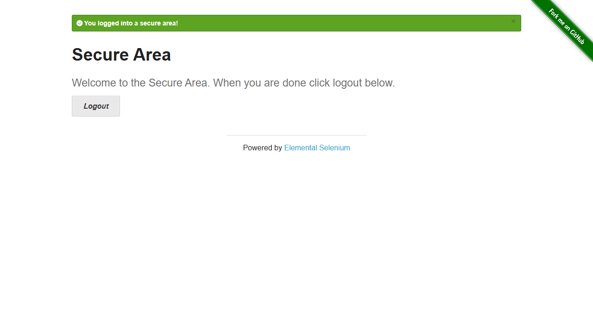
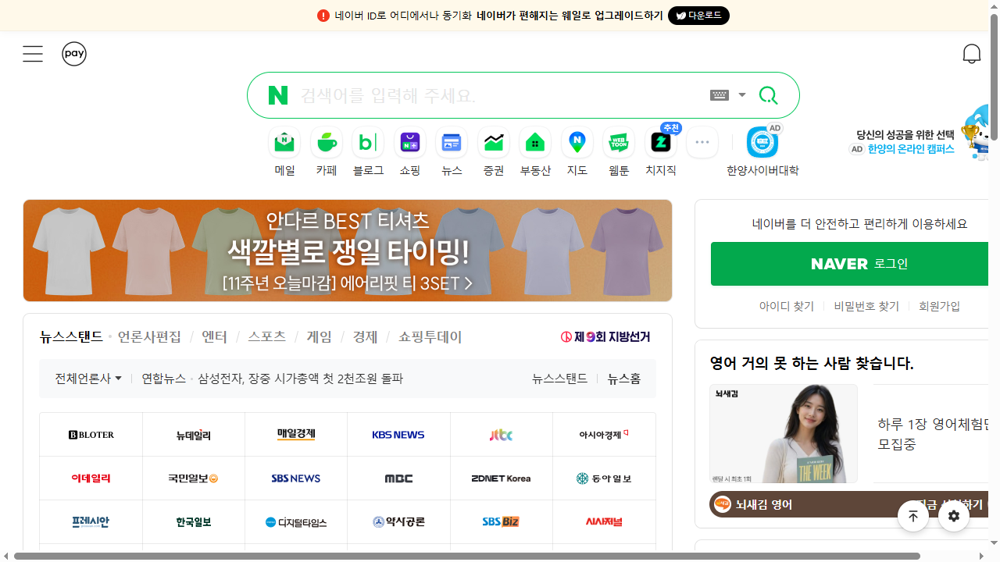
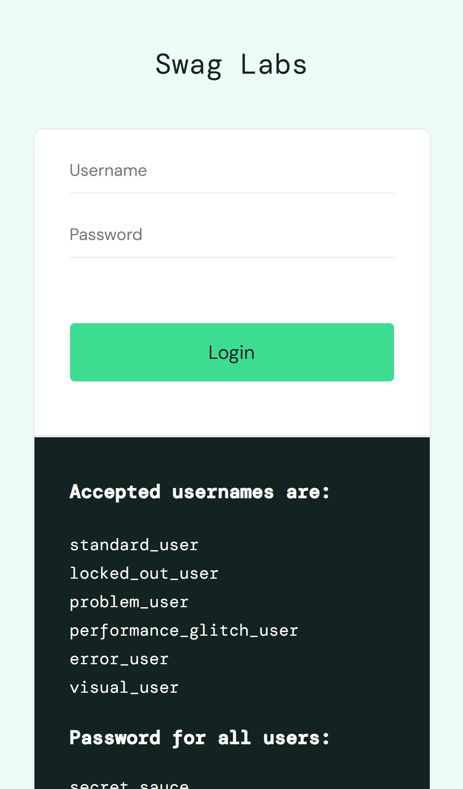
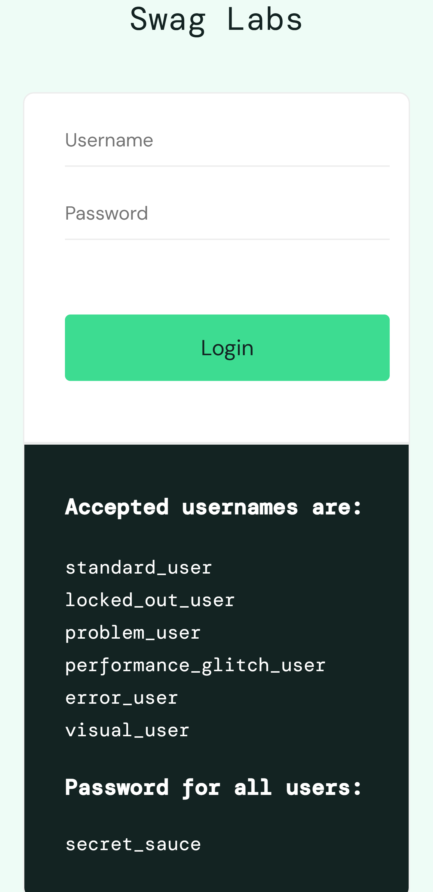
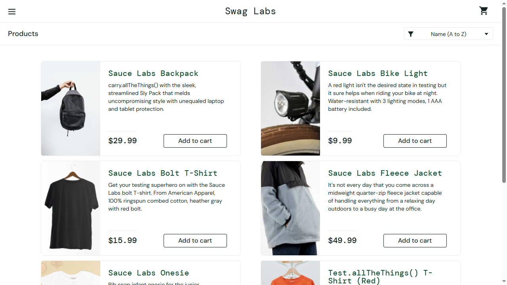
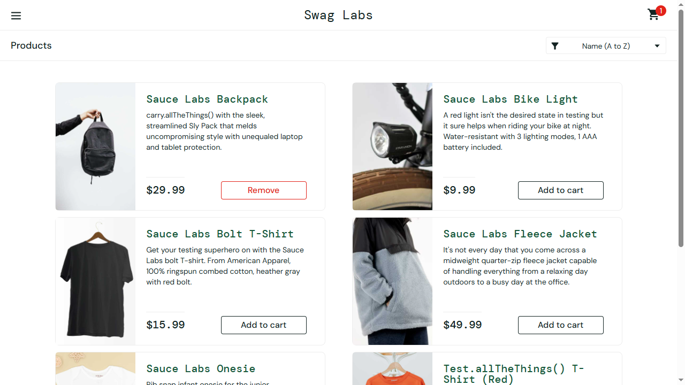

# 🧪 QA 자동화 포트폴리오

Python + Playwright 기반 웹 자동화 테스트 프로젝트입니다.  
QA 16년 실무 경험을 바탕으로 다양한 자동화 테스트를 직접 설계·구현했습니다.

---

## 🛠 기술 스택

| 항목 | 내용 |
|------|------|
| 언어 | Python |
| 자동화 | Playwright |
| 테스트 | pytest |
| CI/CD | GitHub Actions |
| 리포트 | pytest-html |
| 패턴 | Page Object Model (POM) |

---

## 📁 테스트 항목

| 파일 | 내용 |
|------|------|
| test_login.py | 로그인 자동화 (정상/비정상/경계값) |
| test_api.py | REST API 자동화 테스트 |
| test_shop.py | 쇼핑몰 E2E 실전 테스트 |
| test_coverage.py | 테스트 커버리지 측정 |
| test_mobile.py | iPhone / Galaxy 모바일 화면 테스트 |
| test_performance.py | 페이지 로딩 성능 측정 |
| test_multi_browser.py | Chrome / Firefox 멀티 브라우저 테스트 |
| test_pom.py | Page Object Model 패턴 적용 |
| test_naver.py | 네이버 검색 자동화 |
| test_realworld.py | 실전 시나리오 테스트 |

---

## ✅ 주요 기능

- 로그인/로그아웃 자동화 (정상·비정상·경계값 케이스)
- REST API 자동화 테스트 (requests)
- Chrome / Firefox 멀티 브라우저 테스트
- iPhone / Galaxy 모바일 화면 테스트
- 페이지 로딩 성능 측정
- GitHub Actions CI/CD 파이프라인
- HTML 테스트 리포트 자동 생성
- Page Object Model 패턴 적용
- CSV 데이터 기반 parametrize 테스트

---

## 📸 실행 결과

### 로그인 테스트


### 멀티 브라우저 테스트 (Chrome / Firefox)



### 모바일 화면 테스트



### 쇼핑몰 E2E 테스트



---

## ▶️ 실행 방법

```bash
# 1. 저장소 클론
git clone https://github.com/6857174-ui/qa_automation.git
cd qa_automation

# 2. 패키지 설치
pip install playwright pytest pytest-html requests

# 3. Playwright 브라우저 설치
playwright install

# 4. 전체 테스트 실행
pytest --html=report.html

# 5. 특정 파일만 실행
pytest test_login.py -v
```

---

## ⚙️ CI/CD

GitHub Actions를 통해 push 시 자동으로 테스트가 실행됩니다.  
`.github/workflows/` 폴더에서 워크플로우 설정을 확인할 수 있습니다.

---

## 📂 프로젝트 구조

```
qa_automation/
├── .github/workflows/   # GitHub Actions CI/CD
├── pages/               # Page Object Model 클래스
├── assets/              # 테스트용 리소스
├── conftest.py          # pytest 공통 fixture
├── test_login.py
├── test_api.py
├── test_shop.py
├── test_mobile.py
├── test_performance.py
├── test_multi_browser.py
├── test_pom.py
└── report.html          # 테스트 리포트
```